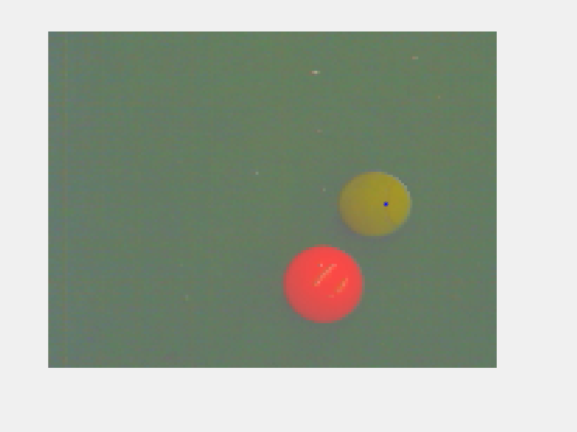
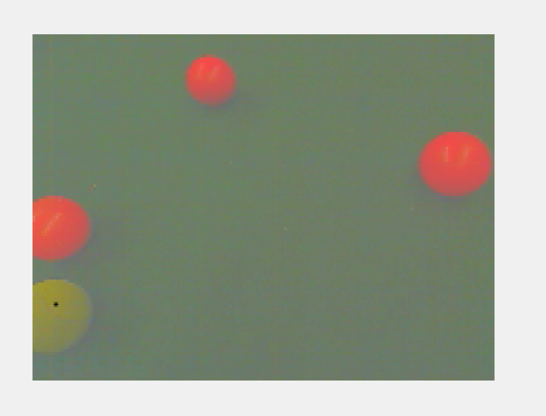

## Ball Detection using Gaussian MLE
### Dhruv Ilesh Shah

There can be multiple ways of detecting a ball in a background, and depending on the scenario, various simple algorithms can be used. Here, we demonstrate an algorithm that can be used without having to calibrate thresholds or color means directly, but train the model by interactive user input. The model estimates multivariate Gaussian using MLE and then uses them to identify similar structural ball in unseen images.

*Software Used:* Matlab R2015b (Unfortunately; The basics, however, are simple and can be easily implemented in Python/C++)

_Data taken from University of Pennsylvania's online course on 'Robotics: Estimation and Learning'_
